# HR Analysis — Анализ HR-данных: удовлетворённость, баланс и вовлечённость сотрудников
## О проекте
HR Analysis — Проект посвящён анализу удовлетворенности сотрудников и балансу их жизни и работы на основе четырёх типов оценок. Основная цель — создание интерактивного дашборда в Power BI и предварительный анализ данных в Python.

## Возможности
- **Анализ удовлетворённости сотрудников** — оценка удовлетворённости окружающей средой, работой и отношениями в коллективе
- **Интерактивный дашборд в Power BI** — визуализация KPI, распределение оценок, сравнение отделов и должностей
- **Предварительный анализ данных (EDA)** — статистика по сотрудникам, группировки, распределения, корреляции
- **Визуализация в Python** — гистограммы, ящики с усами, круговые диаграммы, скрипичные диаграммы для анализа распределений
- **Выводы для бизнеса** — выявление факторов, влияющих на удовлетворённость

## Работа с данными:
- **Источник данных** — файл Excel (HR data satisfaction) с информацией о сотрудниках
- **Обработка в Python (pandas)**:
  - Предварительный просмотр и очистка данных
  - Расчёт базовых метрик (количество сотрудников, средний возраст, распределение по полу и отделам)
  - Группировка и агрегация (суммы, средние значения)
  - Создание категорий общей удовлетворённости (Perfect, Normal, Low)
- **Визуализация в Python (matplotlib + seaborn)** — Скрипичные диаграммы, гистограммы, ящики с усами, круговые диаграммы для предварительного анализа
- **Итоговая визуализация в Power BI** — построение интерактивного дашборда с KPI, матрицами, распределениями и фильтрами

## Аналитические способности:
- Анализ распределения удовлетворённости по отделам и должностям
- Сравнение трёх типов удовлетворённости (Environment, Job, Relationship)
- Корреляционный анализ удовлетворённости с зарплатой и стажем
- Вывод о низкой удовлетворённости в коллективе (88.8% Low, 0% Perfect)

## Технологии
- **Python** 3.11+
- **pandas** >= 2.0.0
- **matplotlib** >= 3.5.0
- **seaborn** ≥ 0.12.0
- **Power BI** Desktop (бесплатная версия)
- **Формат данных** — Excel (.xlsx)


## Технические детали:
### Визуализация использует:
- **Power BI Desktop** — основной инструмент для построения интерактивного дашборда 
- **Matplotlib + Seaborn (Python)** — дополнительная визуализация для предварительного анализа и технической документации

## Результат:
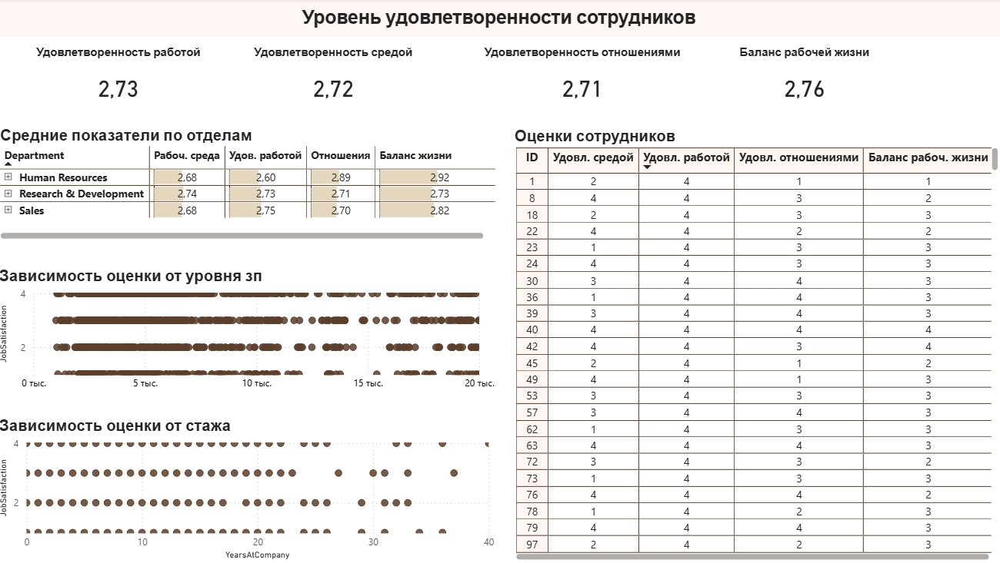

## Предварительный анализ в консоли Python:
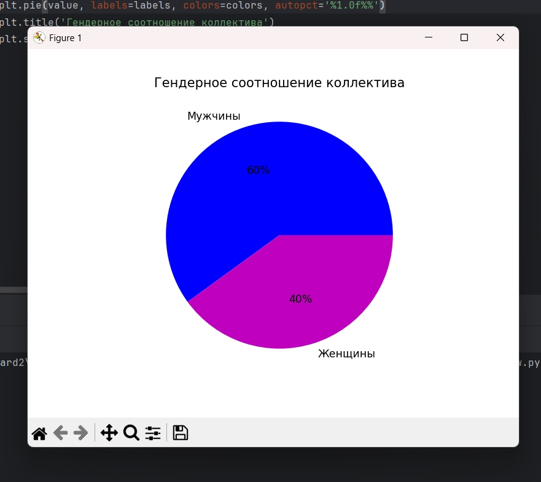
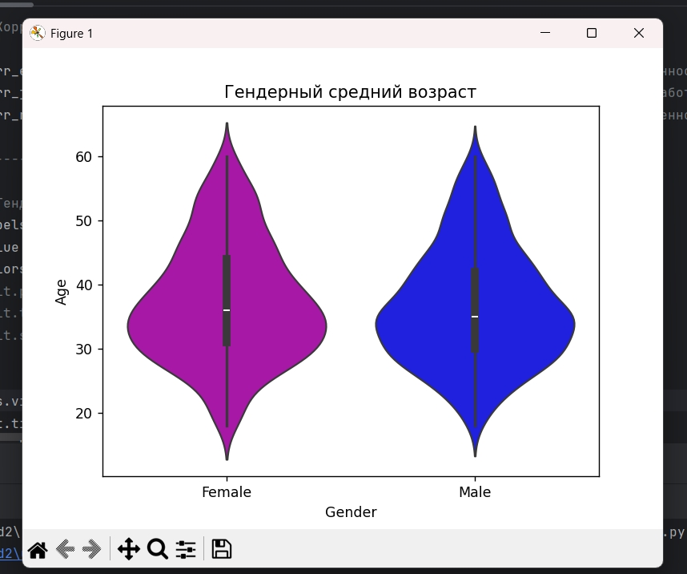
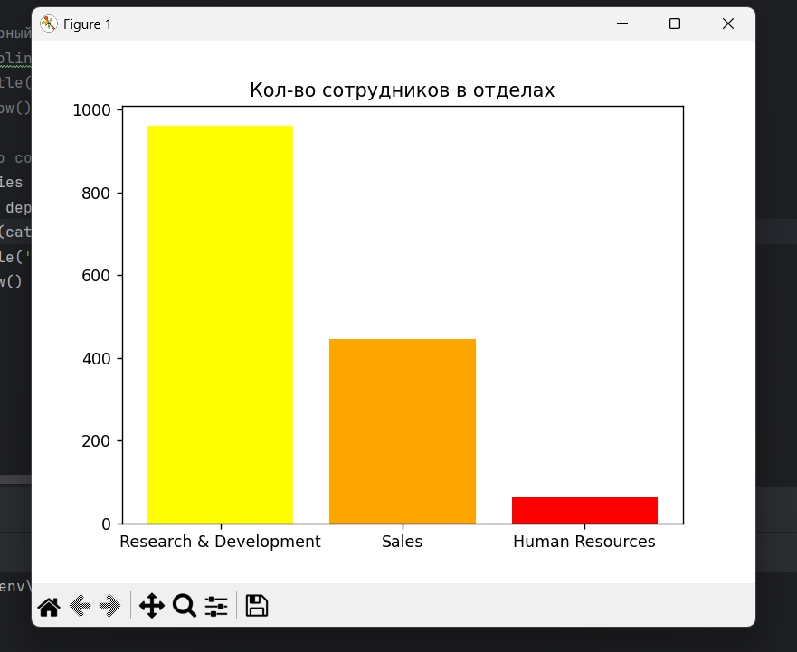
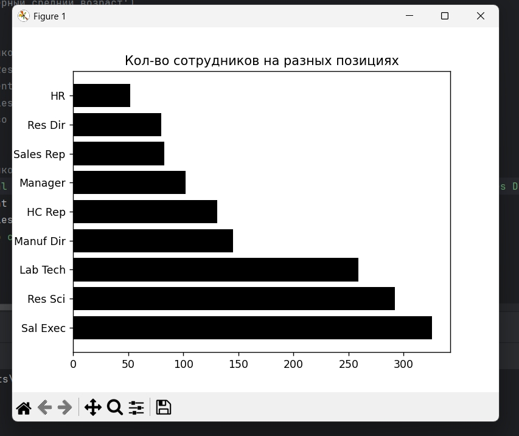
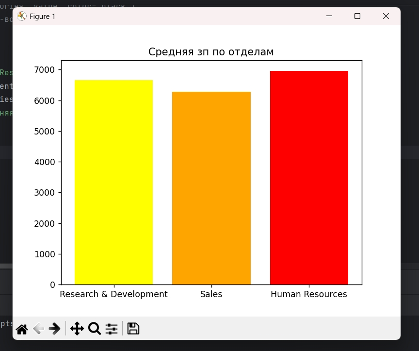
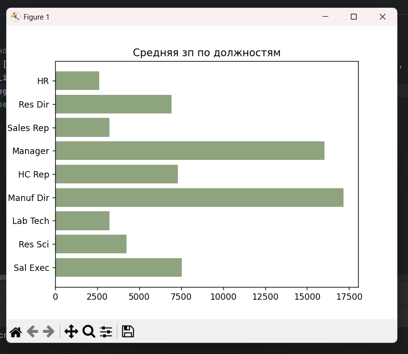
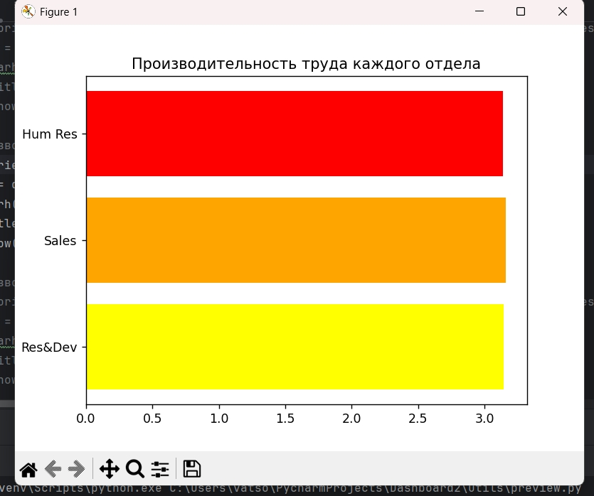
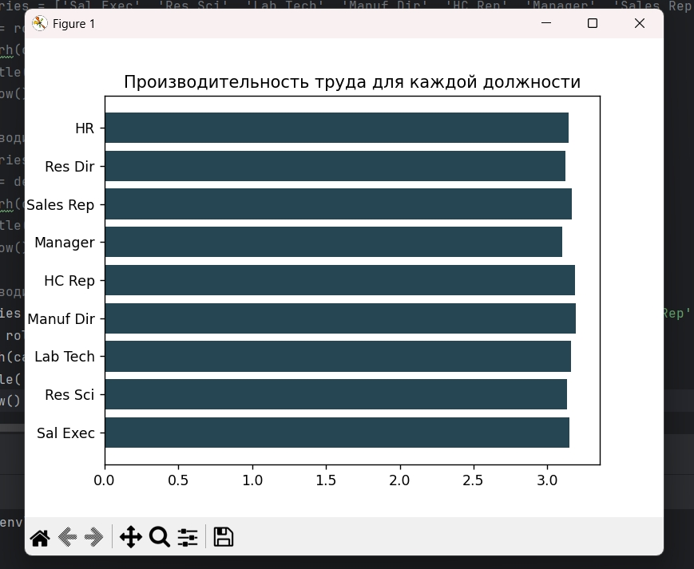
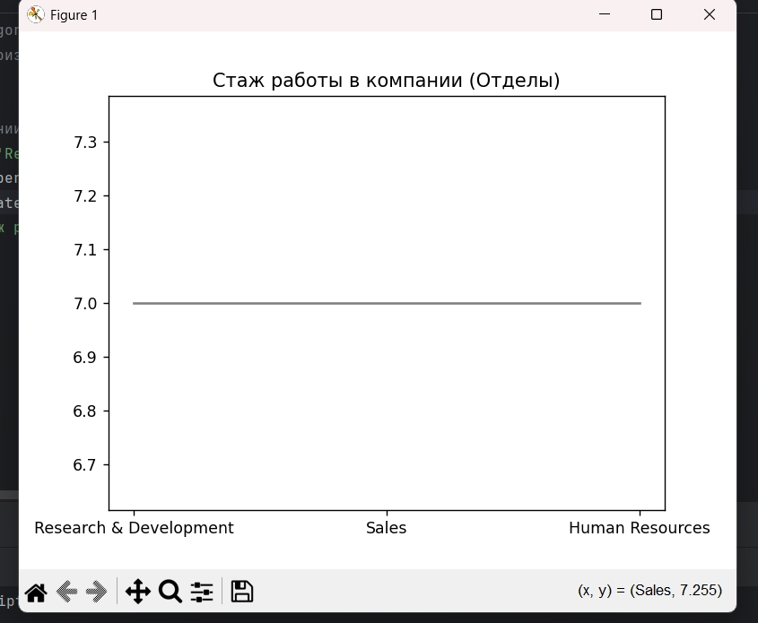
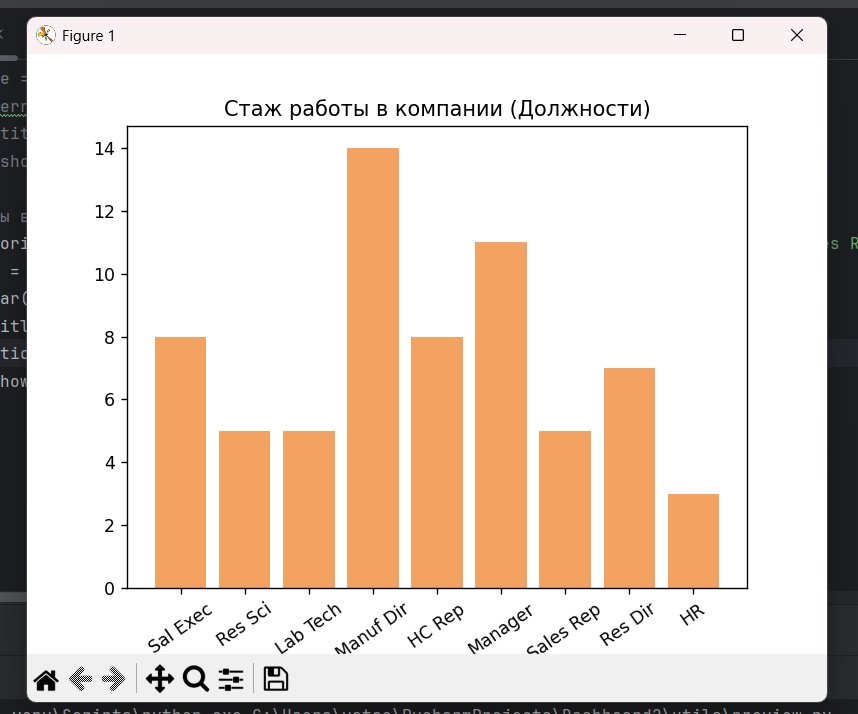
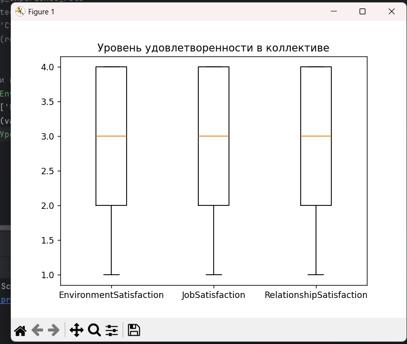
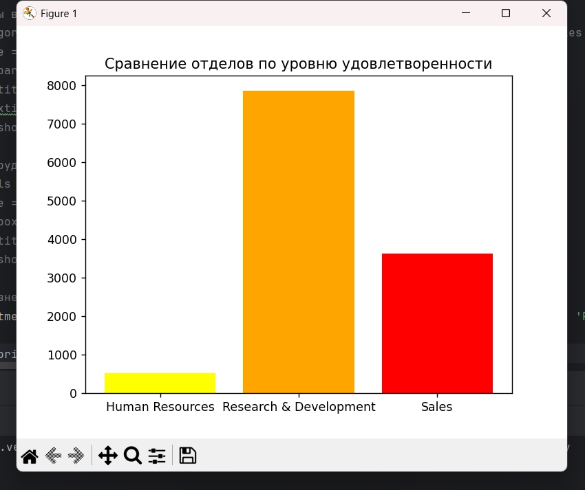
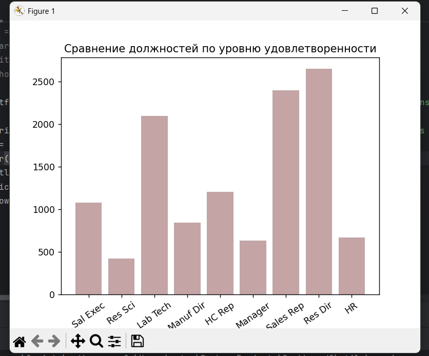
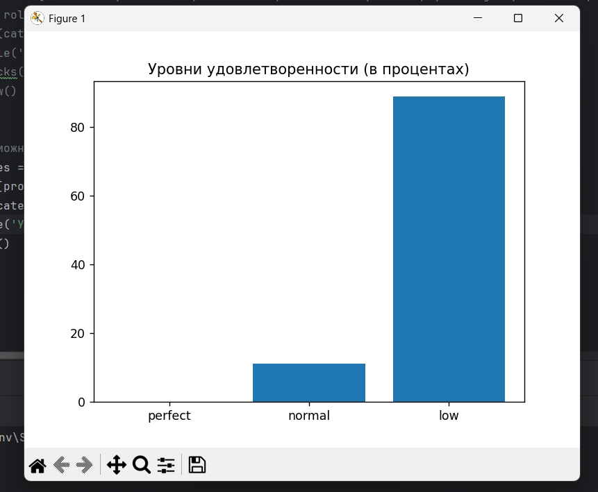

## Установка и запуск

***Клонирование проекта:***
```
git clone https://github.com/Anastasia-0-Iva/HR-Analysis.git
cd HR-Analysis
```

***Создание виртуального окружения:***
```
# Windows
python -m venv venv
.\venv\Scripts\activate

# Linux/macOS
python3 -m venv venv
source venv/bin/activate
```

***Установка зависимостей:***
```
poetry install
```